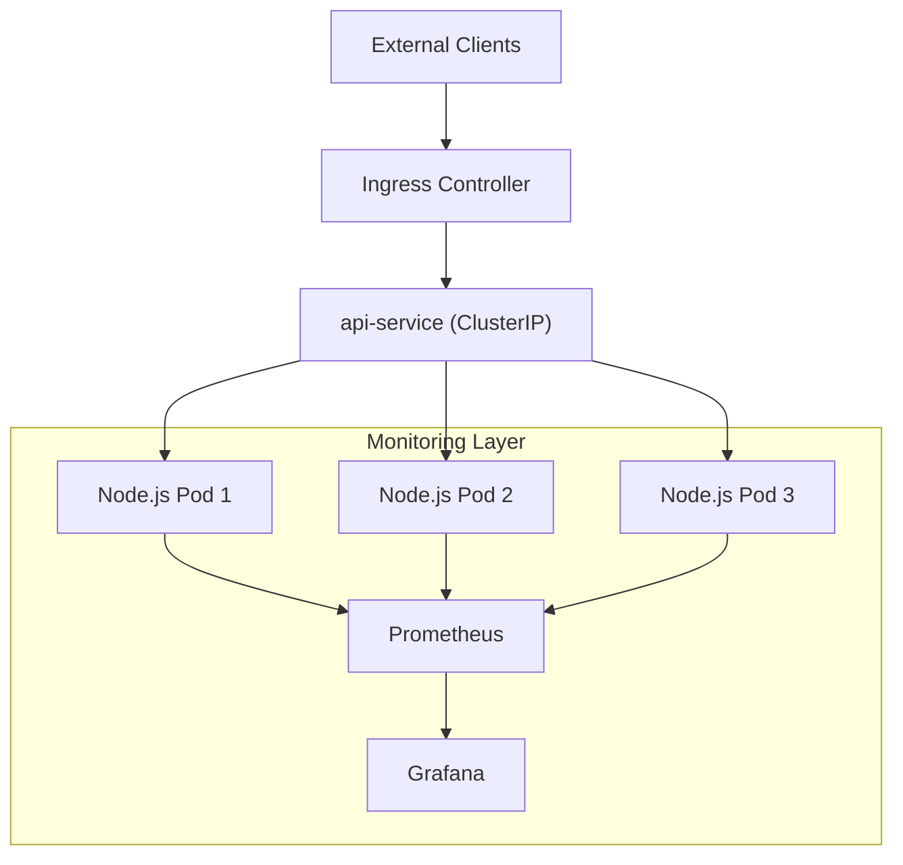

## Full Repository Structure
```text
devops-demo-api/
├── README.md
├── .gitignore
├── .gitlab-ci.yml
├── docker-compose.yml
├── app/
│   ├── Dockerfile
│   ├── package.json
│   └── server.js
├── nginx/
│   └── nginx.conf
├── monitoring/
│   └── prometheus/
│       └── prometheus.yml
├── grafana/
│   └── dashboard.json
└── k8s/
    ├── namespace.yaml
    ├── app-deployment.yaml
    ├── app-service.yaml
    ├── ingress.yaml
    ├── prometheus-configmap.yaml
    ├── prometheus-deployment.yaml
    ├── prometheus-service.yaml
    ├── grafana-deployment.yaml
    └── grafana-service.yaml
```

# DevOps Demo API

A complete, production-ready DevOps demonstration project showcasing containerization, CI/CD, traffic management, observability, and zero-downtime deployment.

---

## Features

- Node.js REST API with `GET /status` and `POST /data`
- Docker multi-stage containerization
- Nginx Reverse Proxy (Docker Compose) + Kubernetes Ingress
- Prometheus metrics integration
- Grafana dashboard
- Horizontal scaling (easily handles **100+ requests/second**)
- Zero-downtime deployment using Kubernetes
- GitLab CI/CD pipeline

---

### Quick Start (Docker Compose)

```bash
git clone https://github.com/agkanon/devops-demo-api.git
cd devops-demo-api

docker compose up --build -d

```
---
### 🌐 Access URLs (Docker Compose)

| Service     | URL                          | Description            |
|------------|------------------------------|------------------------|
| API        | http://localhost:8080        | Main API               |
| Metrics    | http://localhost:8080/metrics| Prometheus metrics     |
| Prometheus | http://localhost:9090        | Prometheus UI          |
| Grafana    | http://localhost:3001        | Grafana (admin/admin)  |

---
### Testing the API
```bash
# Health check
curl http://localhost:8080/status

# Send data
curl -X POST http://localhost:8080/data \
  -H "Content-Type: application/json" \
  -d '{"name": "Anamul", "action": "test"}'
```  

### Kubernetes Deployment
```bash
kubectl create namespace devops-demo --dry-run=client -o yaml | kubectl apply -f -
kubectl apply -f k8s/
```
**Access the API**: `http://api.devops-demo.local`
(Add `127.0.0.1 api.devops-demo.local` to your `/etc/hosts` file for local testing)

### Testing the API:
```bash
# GET - Health Check
curl http://api.devops-demo.local/status

# POST - Send Data
curl -X POST http://api.devops-demo.local/data \
  -H "Content-Type: application/json" \
  -d '{"name": "Anamul", "action": "test"}'
```

### How the System Can Handle ~100 Requests/Second
The architecture is designed to easily exceed **100 requests per second:**
### Performance Highlights

A **single Node.js** container can handle **800 – 2000+ requests/second** due to its event-driven, non-blocking nature.
With **3 replicas** (default), the system can comfortably handle **2000 – 5000+ requests/second.**

### Scaling Strategy

**Horizontal Scaling:** Run multiple stateless pods/containers behind a load balancer (Kubernetes Service + Ingress).
**Easy Scaling Commands:**
```bash
# Docker Compose
docker compose up -d --scale app=5

# Kubernetes
kubectl scale deployment api-app --replicas=5 -n devops-demo
```
**Production Ready:** Use Horizontal Pod Autoscaler (HPA) based on CPU or custom metrics (e.g., requests per second).

### Why It's Efficient

Stateless application design
Efficient load balancing via Kubernetes Ingress / Nginx
Low-overhead Prometheus metrics
Health checks and readiness probes ensure optimal traffic routing

**Conclusion:** 100 requests/sec is a very light load. This system can handle significantly higher traffic with automatic scaling.

### 🚀 System Architecture

This project demonstrates a scalable Node.js application deployed on Kubernetes with monitoring using Prometheus and Grafana.

### 🏗️ Architecture Overview


---

### Monitoring & Observability
Custom metrics: Request count, latency, error rate, CPU, memory.
Import the ready dashboard: `grafana/dashboard.json` in Grafana

## 🚀 Zero-Downtime Deployment

This project ensures seamless deployments with no service interruption using Kubernetes best practices.

### 🔄 Strategy

- Uses **Kubernetes RollingUpdate** strategy  
- Liveness & Readiness probes on `/status` endpoint  
- New pods are fully healthy before receiving traffic  
- Old pods are removed only after new ones are ready 

### 🛠️ Tech Stack

| Layer          | Technology                          |
|----------------|------------------------------------|
| **Backend**    | Node.js + Express + prom-client    |
| **Container**  | Docker (multi-stage)               |
| **Routing**    | Kubernetes Ingress (NGINX)         |
| **Monitoring** | Prometheus + Grafana               |
| **Orchestration** | Docker Compose & Kubernetes     |
| **CI/CD**      | GitLab CI                          |


---

